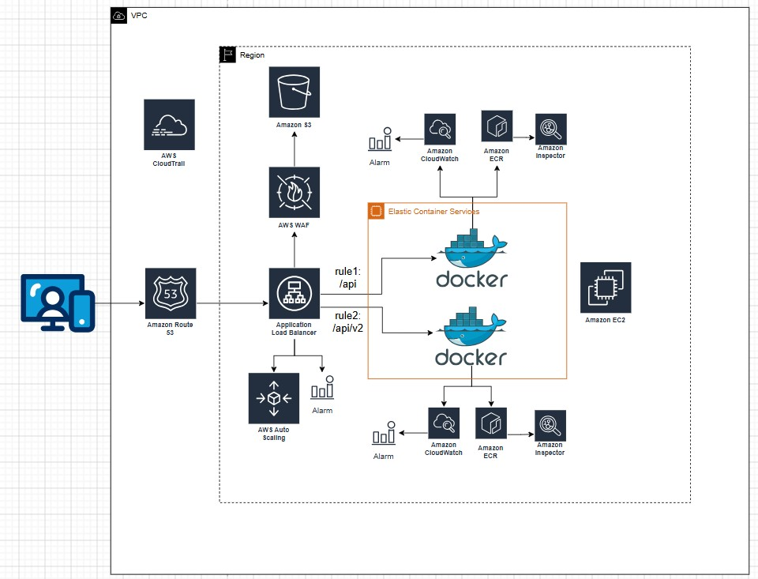

# AWS infrastructure diagrams
A repository of **images** with **Amazon Web Services (AWS)** architecture diagrams. It works as a visual reference collection: from **simple** topologies to **more complete** views of real or design environments.

It does not include deployment code or infrastructure-as-code templates—only exported diagrams (for example JPG, PNG, or SVG).

## Current contents
- [`infrastructure-aws.jpg`](./infrastructure-aws.jpg) — AWS infrastructure diagram.

## Organizing new diagrams
Suggested conventions to keep the repo tidy as you add more images:

- **Clear names**: include context (environment, region, or purpose) and, when useful, `simple` / `complete` or a version number, for example `basic-vpc-simple.png`, `prod-multi-az-v2.jpg`.
- **Format**: JPG or PNG for exports; SVG when your tool supports it and you want lossless scaling.
- **Optional folders**: as volume grows, group by type (`simple/`, `complete/`) or by domain (`network/`, `data/`, `observability/`).

Update this README when you add notable diagrams, or link straight to files from the repository tree.

## Common tools
Diagrams are often built with [AWS Architecture Icons](https://aws.amazon.com/architecture/icons/), [draw.io / diagrams.net](https://www.diagrams.net/), Lucidchart, Miro, or other tools that work with the official AWS icons.

## License
Images are for personal use. AWS icons and marks are subject to the [AWS Trademark Guidelines](https://aws.amazon.com/legal/trademark-guidelines/).
