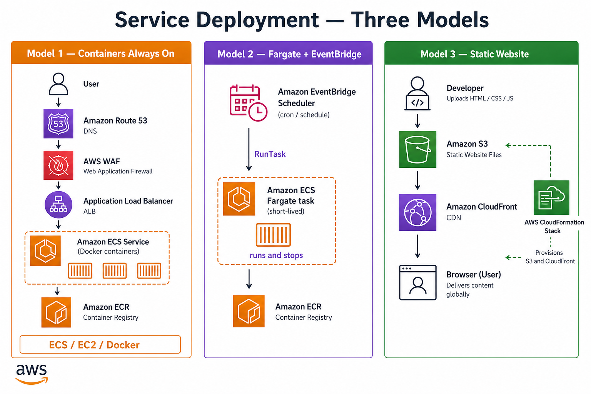
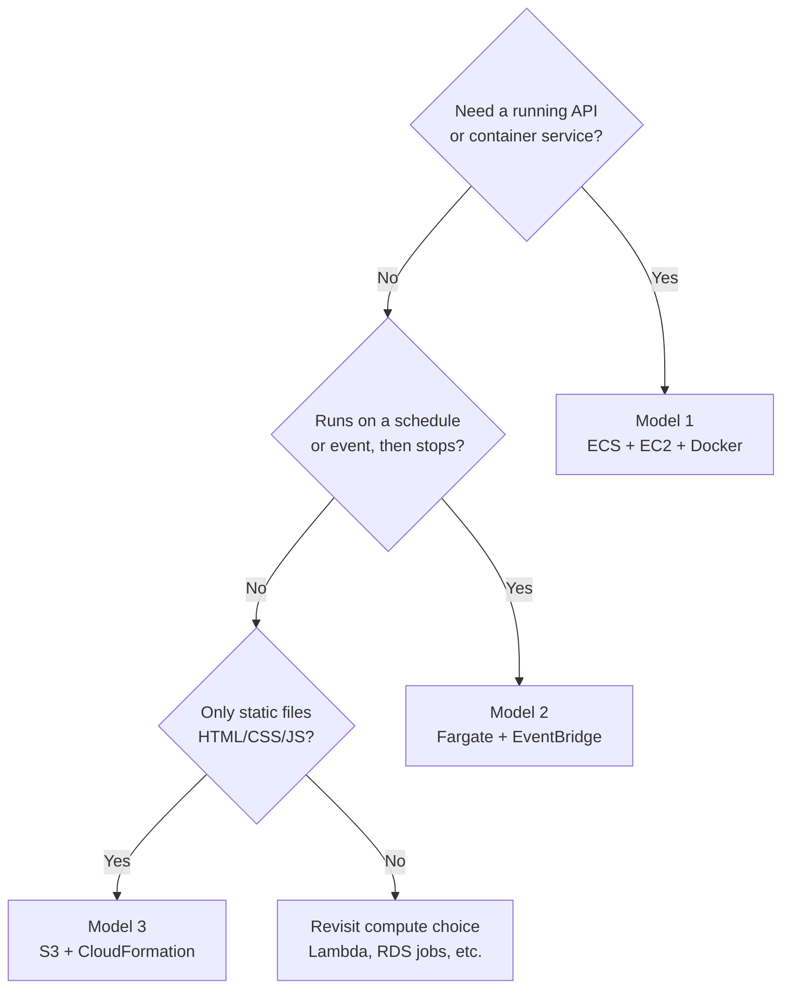

# 🚀 Service deployment — three models
This repo documents **three ways to deploy workloads on AWS**. Pick by **what you are shipping** and **how it should run**, not by habit.

Reference diagram: [`diagram.jpg`](./diagram.jpg).

## 🔎 What the diagram shows
- **Model 1 — Containers:** user traffic through **ALB** to an **ECS Service** (Docker on ECS/EC2); images from **ECR**; always-on APIs.
- **Model 2 — Fargate + EventBridge:** **EventBridge Scheduler** triggers **`RunTask`** on **Fargate**; the task runs the job and stops — no 24/7 service.
- **Model 3 — Static website:** **HTML/CSS/JS** uploaded to **S3**; **CloudFormation** provisions the stack; **CloudFront** serves users over HTTPS.

| Model | When to use it | Folder |
| --- | --- | --- |
| **1 — Containers (ECS / EC2 / Docker)** | APIs, backends, microservices that must stay **always on** behind an ALB, with Docker images in ECR | [`complete-infra-with-services-security/`](../complete-infra-with-services-security/) |
| **2 — Fargate + EventBridge** | Jobs that **start on a schedule or event**, run, and **stop** — no 24/7 service | [`ecs-fargate-eventbridge/`](../ecs-fargate-eventbridge/) |
| **3 — Static website (S3 + CloudFormation)** | **HTML / CSS / JS** sites with no server — assets in S3, infra as CloudFormation | [`s3-static-website-cloudformation/`](../s3-static-website-cloudformation/) |

## ⚡ Quick pick

## 📊 Comparison
| Criterion | **Containers (ECS)** | **Fargate + EventBridge** | **Static S3** |
| --- | --- | --- | --- |
| **Workload** | Dockerized app (API, worker always on) | Batch, cron, event-triggered task | Static HTML site |
| **Always running?** | ✅ Service behind ALB (`desiredCount ≥ 1`) | ❌ Task runs and exits | N/A (files served on request) |
| **Compute** | ECS on **EC2** or **Fargate** | **Fargate** `RunTask` | None (S3 + optional CloudFront) |
| **Trigger** | HTTP via ALB | **EventBridge** schedule or event | Browser request |
| **Images / artifacts** | **ECR** Docker image | **ECR** Docker image | `.html`, `.css`, `.js`, assets |
| **IaC in this repo** | Diagram + security matrix | [`diagram.jpg`](../ecs-fargate-eventbridge/diagram.jpg) + flow | [`diagram.jpg`](../s3-static-website-cloudformation/diagram.jpg) + CloudFormation pattern |
| **Typical cost driver** | Running tasks / EC2 fleet | Per task run (seconds/minutes) | S3 storage + requests (+ CDN) |

## 1️⃣ Containers — ECS, EC2, Docker
Long-lived **containerized services**: build a Docker image → push to **ECR** → ECS **Service** keeps tasks running → **ALB** routes traffic.

- **Diagram + security stack:** [`complete-infra-with-services-security/`](../complete-infra-with-services-security/) — WAF, Inspector, ECR scanning, logging, Security Hub.
- **Base infrastructure diagram:** [`complete-infrastructure/`](../complete-infrastructure/) — ALB, path routing, CloudWatch, ECS/ECR.
- **Launch type choice:** [`ecs-fargate-vs-ec2/`](../ecs-fargate-vs-ec2/) — Fargate vs EC2, always-on vs batch patterns.
- **Image lifecycle:** [`ecr-lifecycle-ecs/`](../ecr-lifecycle-ecs/) — prune old ECR tags after deploy.

## 2️⃣ Fargate + EventBridge
**No Service, no ALB.** EventBridge (Scheduler or rule) calls ECS **`RunTask`** on **Fargate**; the task runs the job and stops.

- **Guide:** [`ecs-fargate-eventbridge/`](../ecs-fargate-eventbridge/)
- **Related pattern:** one-off / scheduled tasks in [`ecs-fargate-vs-ec2/`](../ecs-fargate-vs-ec2/#-task-patterns-the-three-tipos-de-task).

## 3️⃣ Static website — S3 + CloudFormation
Plain **static files** (HTML, CSS, JS, images). No ECS, no EC2. **S3** hosts the site; **CloudFormation** provisions bucket, policies, and optionally **CloudFront**.

- **Guide:** [`s3-static-website-cloudformation/`](../s3-static-website-cloudformation/)

## 🔗 Other topics (not deployment models)
Decision guides and supporting patterns live alongside these three models — databases, bastion access, API Gateway ingress, IAM policies, etc. See the [main index](../README.md).
