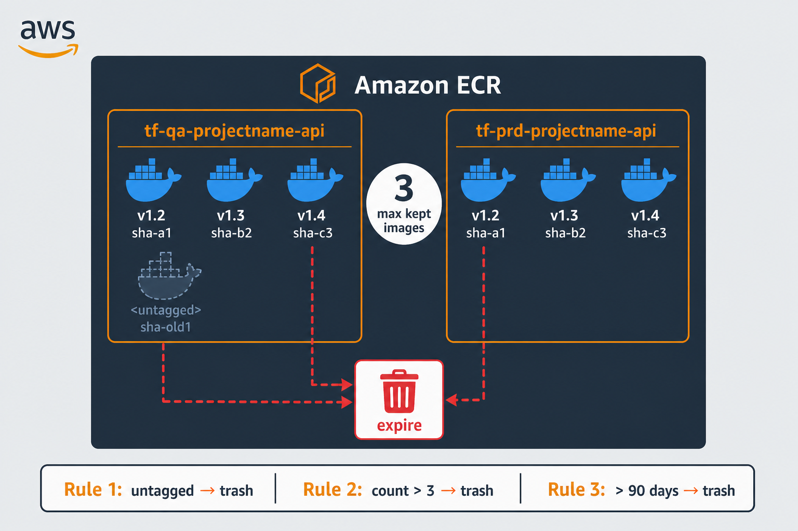

# 📦 ECR lifecycle + ECS
ECR repos such as `tf-qa-projectname-api` and `tf-prd-projectname-api` accumulate images over time. **Lifecycle policies** prune old layers; images still **in use** by ECS (running tasks or a task definition revision) are **not** deleted by AWS.



## 📜 Three rules (default)
| Priority | Rule |
| --- | --- |
| **1** | Expire **untagged** images after **1 day** |
| **2** | Keep only the **last 3** images (`imageCountMoreThan`) |
| **3** | Expire images older than **90 days** (safety net) |

Lifecycle removes by **age / count / tag**, not by CVE. Fix the image, deploy a new task definition, then old digests can be cleaned up once nothing references them.

## 🛠️ Apply with Terraform
1. Edit **[`terraform/repositories.tf`](./terraform/repositories.tf)** — set `project_name` and/or the `repository_names` list (repos must already exist in AWS).
2. Run:

```bash
cd terraform
terraform init
terraform apply
```

That applies all three rules to every repo in the list. Optional: `terraform.tfvars` for `aws_region` or rule numbers only — **repo names stay in `repositories.tf`**.

Details: [`terraform/README.md`](./terraform/README.md).

## ⚠️ If images are not deleted
Usually an old **ECS task definition revision** still references the digest. Deregister unused revisions in CI so ECR can expire those images.

## 🔗 Related
- [`complete-infrastructure/`](../complete-infrastructure/) — ECS + ECR in the stack
- [ECR lifecycle policies](https://docs.aws.amazon.com/AmazonECR/latest/userguide/LifecyclePolicies.html)