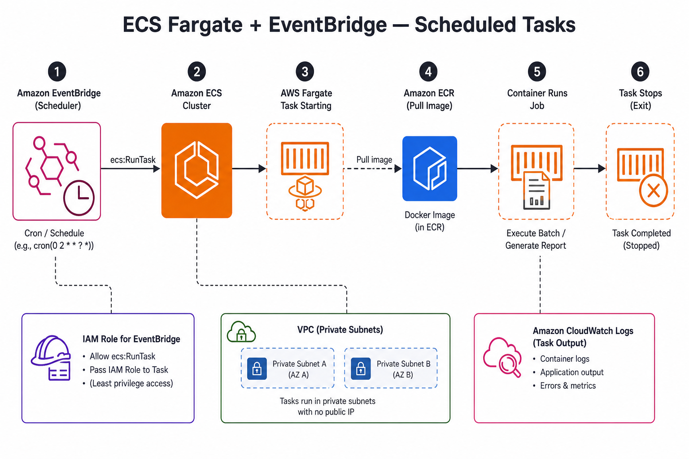
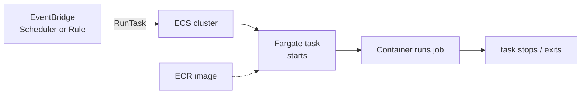

# ⏱️ ECS Fargate + EventBridge — scheduled and event-driven tasks
Deploy **short-lived container jobs** on **AWS Fargate** without keeping a service running 24/7. **Amazon EventBridge** (Scheduler or rules) triggers **`RunTask`** on ECS; the task starts, does the work, and **stops**.

Reference diagram: [`diagram.jpg`](./diagram.jpg).

## 🔎 What the diagram shows
- **EventBridge Scheduler** (or a rule) fires on a **cron** or **event pattern**.
- ECS receives **`RunTask`** — no ECS Service, no ALB.
- **Fargate** starts a task that pulls its image from **ECR**, runs the job, and **exits**.
- **IAM** lets EventBridge invoke the task; **CloudWatch Logs** captures output; tasks run in **VPC** subnets.

> **Not covered here:** always-on APIs behind an ALB (see [`complete-infra-with-services-security/`](../complete-infra-with-services-security/)) or scale-to-zero **Services** on SQS (see [`ecs-fargate-vs-ec2/`](../ecs-fargate-vs-ec2/)). This model is **standalone tasks**, not a long-lived ECS Service.

## 🎯 When to use this model
| Fit | Example |
| --- | --- |
| **Cron / schedule** | Nightly report, DB cleanup, cache warm-up at 02:00 |
| **React to an event** | S3 object created → process file; custom event on EventBridge bus |
| **One-off batch** | Migration script, data export, reindex job |
| **Pay only while running** | Minutes of Fargate vCPU/memory per run, not idle service hours |

## 🧱 How it works

| Piece | Role |
| --- | --- |
| **Task definition** | Fargate, CPU/memory, container image from **ECR**, env, IAM **task role** |
| **Cluster** | Logical ECS cluster (Fargate does not need EC2 instances) |
| **EventBridge Scheduler** | **Cron/rate** expressions — preferred for recurring schedules |
| **EventBridge rule** | **Event pattern** (e.g. S3, custom bus) → target ECS task |
| **IAM** | Role that allows EventBridge to `ecs:RunTask` + pass task execution role |
| **No ECS Service** | No `desiredCount`, no ALB — each trigger is one **task run** |

## 📊 Scheduler vs rule
| Trigger | Use | ECS integration |
| --- | --- | --- |
| **EventBridge Scheduler** | Fixed **schedule** (cron, rate) | Target: ECS task with task definition ARN, cluster, subnets, security groups |
| **EventBridge rule** | **Event pattern** (S3, API, custom) | Same `RunTask` target; map event fields to task env if needed |

## ⚡ Quick pick
| If you need… | Use |
| --- | --- |
| Run every night at 3am | **Scheduler** + cron |
| Run 5 minutes after another job | **Scheduler** + one-time schedule |
| Run when a file lands in S3 | **Rule** on `aws.s3` / EventBridge notification |
| Run when your app publishes a custom event | **Rule** on custom **event bus** |

## ✅ Choose this model when
- The workload is **not** an HTTP API that must answer requests all day.
- You already package the job as a **Docker image** in ECR.
- You want **Fargate** (no EC2 hosts) and **per-run** billing.
- Schedule or event semantics map cleanly to **start task → exit**.

## 🚫 Avoid when
| Situation | Better model |
| --- | --- |
| Public API / web app 24/7 | [`complete-infra-with-services-security/`](../complete-infra-with-services-security/) — ECS **Service** + ALB |
| Sub-second HTTP on sparse traffic | **Lambda** |
| Static HTML/CSS/JS site | [`s3-static-website-cloudformation/`](../s3-static-website-cloudformation/) |
| Continuous queue processing at variable load | ECS **Service** + SQS + autoscaling (min 0 possible) — [`ecs-fargate-vs-ec2/`](../ecs-fargate-vs-ec2/) |

## 🛠️ Deploy checklist
1. **ECR** — build and push the job image (same flow as long-lived services).
2. **Task definition** — `requiresCompatibilities: FARGATE`, `networkMode: awsvpc`, execution + task roles.
3. **Cluster** — create or reuse an ECS cluster.
4. **Networking** — subnets (often private), security groups, optional NAT for outbound calls.
5. **EventBridge** — Scheduler schedule or rule → target **ECS RunTask** (cluster, task definition, revision, network config).
6. **IAM** — trust EventBridge/Scheduler; `ecs:RunTask`, `iam:PassRole` for task roles.
7. **Observability** — CloudWatch Logs for the task; alarm on failed invocations / task exit code.

## 🔗 Related in this repo
- [`deploy-services/`](../deploy-services/) — all three deployment models.
- [`ecs-fargate-vs-ec2/`](../ecs-fargate-vs-ec2/) — Fargate vs EC2; **one-off / batch** task pattern.
- [`ecr-lifecycle-ecs/`](../ecr-lifecycle-ecs/) — lifecycle policies for job images.
- [`complete-infra-with-services-security/`](../complete-infra-with-services-security/) — contrast with always-on ECS + security stack.

## 📚 AWS documentation
- [Scheduled tasks on ECS](https://docs.aws.amazon.com/AmazonECS/latest/developerguide/tasks-scheduled-eventbridge-scheduler.html)
- [EventBridge Scheduler](https://docs.aws.amazon.com/scheduler/latest/UserGuide/what-is-scheduler.html)
- [ECS RunTask](https://docs.aws.amazon.com/AmazonECS/latest/APIReference/API_RunTask.html)
- [Fargate task networking](https://docs.aws.amazon.com/AmazonECS/latest/developerguide/fargate-task-networking.html)
