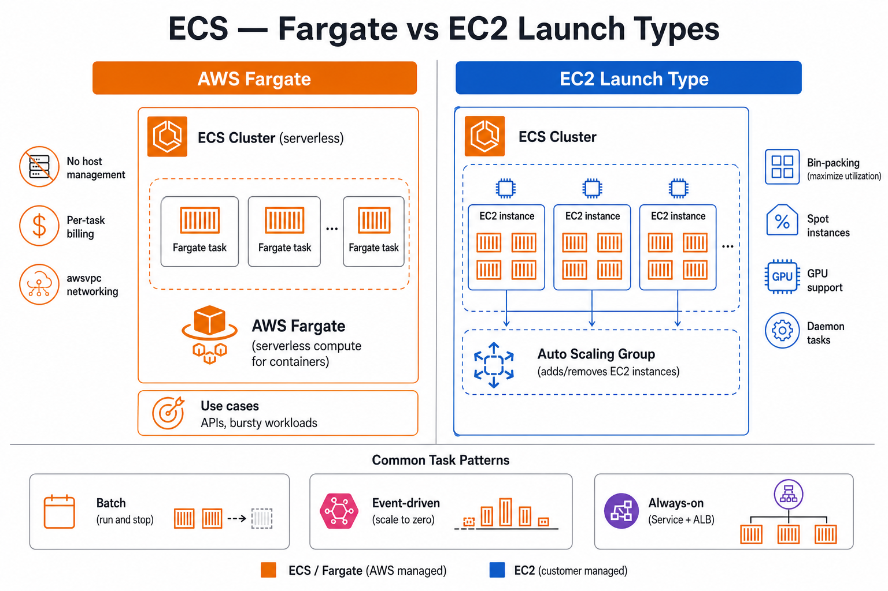
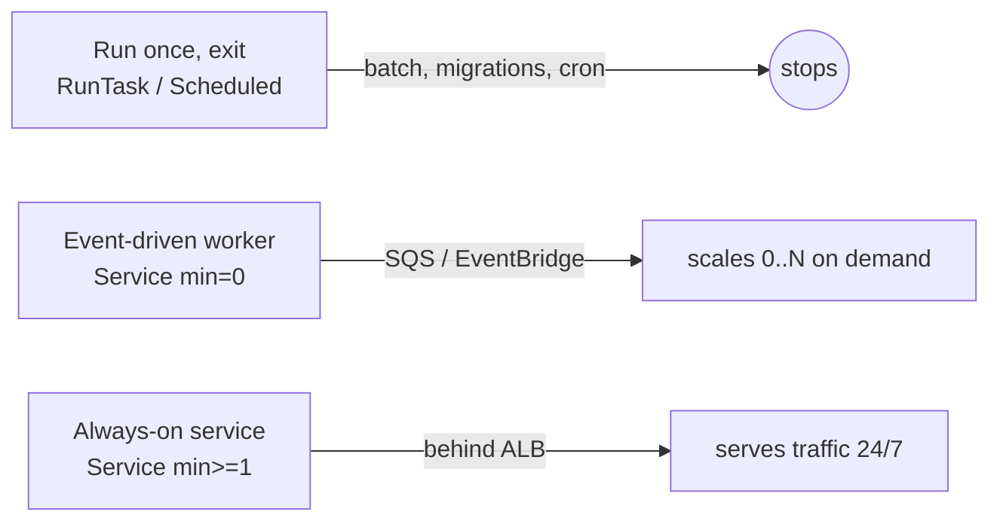
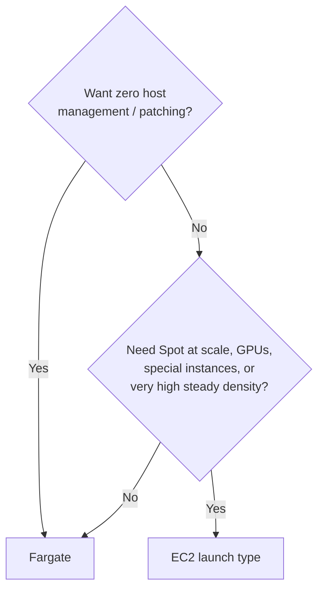

# ⚙️ ECS — Fargate vs EC2 (launch types) + task patterns
Short **decision guide** for running containers on **Amazon ECS**. Two axes that people often confuse:
- **Capacity axis (this guide's focus):** who provides the compute — **AWS Fargate** (serverless) vs **EC2** (you manage the hosts).
- **Workload axis:** *how* a task runs — one-off, event-driven, or always-on (see [task patterns](#-task-patterns-the-three-tipos-de-task)).

Reference diagram: [`diagram.jpg`](./diagram.jpg).

## 🔎 What the diagram shows
- **Left — Fargate:** ECS schedules tasks on **serverless** capacity; no EC2 hosts to manage; per-task vCPU/memory billing.
- **Right — EC2 launch type:** ECS runs tasks on **your EC2 fleet** (ASG); **bin-packing** multiple tasks per instance; **Spot**, **GPU**, and **daemon** tasks.
- **Bottom — task patterns:** **batch** (run and stop), **event-driven** (scale to zero on SQS/events), **always-on** (Service behind ALB) — independent of launch type.

> **Not covered here:** ECS vs EKS vs Lambda (compute model choice), CI/CD to ECS, or autoscaling deep dives. For the image side see [`ecr-lifecycle-ecs/`](../ecr-lifecycle-ecs/); for the full stack see [`complete-infrastructure/`](../complete-infrastructure/).

## 🧱 ECS in one screen
| Piece | What it is |
| --- | --- |
| **Task definition** | The blueprint: image, CPU/memory, ports, env, IAM task role. Runs nothing by itself. |
| **Task** | A running instance of a task definition (one or more containers together). |
| **Service** | Keeps N tasks alive, wires them to the ALB, does rolling deploys and **autoscaling**. |
| **Cluster** | Logical grouping; capacity comes from **Fargate** or **EC2**. |

**Key idea:** *launch type* (Fargate/EC2) is **independent** from *task pattern*. Any pattern below runs on either launch type.

## 🔁 Task patterns (the three "tipos de task")

| Pattern | What it is | How you run it | Typical use |
| --- | --- | --- | --- |
| **One-off / batch** | Starts, does the work, **stops** | Standalone `RunTask`, or **Scheduled task** (EventBridge Scheduler) | DB migrations, nightly reports, cron jobs |
| **Event-driven (scale-to-zero)** | "There, but only consumes **when called**" | **Service** + Application Auto Scaling with **min = 0**, scaled by **SQS** depth / EventBridge | Queue workers, async processing, spiky jobs |
| **Always-on** | "**Always on**" | **Service** with `desiredCount ≥ 1` behind an **ALB**, autoscaled by CPU/RPS | APIs, web apps, long-lived consumers |

> True **scale-to-zero for HTTP** behind an ALB isn't native (the ALB needs a healthy target). Clean scale-to-zero in ECS is for **queue/event workers**; for HTTP-to-zero look at **Lambda** or **App Runner**. A 4th option, the **daemon** service (one task per host), exists **only on the EC2 launch type** (log/metric agents).

## ⚡ Quick pick (Fargate vs EC2)

| If you need… | Lean toward |
| --- | --- |
| No servers to patch/scale, per-task billing, fastest to ship | **Fargate** |
| **GPUs**, special instance families, kernel/daemon access, max packing density | **EC2** |
| Aggressive cost cutting on **steady, high** load with **Spot** + bin-packing | **EC2** (often) |
| Spiky/low/unpredictable load, small team, minimal ops | **Fargate** |

## 📊 Decision table
| Criterion | **AWS Fargate** | **EC2 launch type** |
| --- | --- | --- |
| **You manage** | Tasks only (no hosts) | EC2 instances, AMIs, patching, scaling, ECS agent |
| **Billing** | Per task **vCPU + memory** per second | Per **EC2 instance** (whatever runs on it) |
| **Capacity** | On-demand, no cluster to size | You size/scale the cluster (ASG / Capacity Providers) |
| **Density / bin-packing** | One task = its own sizing | Pack many tasks per instance → cheaper at high density |
| **Spot savings** | **Fargate Spot** | **EC2 Spot** (more flexibility / instance variety) |
| **GPU / special instances** | ❌ (limited) | ✅ Full instance-family choice, GPUs |
| **Daemon tasks** | ❌ | ✅ (one task per instance) |
| **Host access / privileged** | Restricted (no host, no `--privileged`) | Full host control if needed |
| **Networking** | `awsvpc` (ENI per task) | `awsvpc`, `bridge`, or `host` |
| **Scaling speed** | Fast, no warm hosts needed | Need warm/standby capacity to launch fast |
| **Ops overhead** | **Lowest** | Higher (you own the fleet) |
| **Best fit** | Most services, APIs, workers, bursty | Cost-optimized steady fleets, GPU/ML, special needs |

## ✅ Choose **Fargate** when
- You want **no host management** (no AMIs, no patching, no cluster sizing).
- Workload is **bursty, low, or unpredictable**; you'd rather pay per task.
- Team is small or you want the **fastest path** to production.
- **Fargate Spot** covers your interruptible workloads.

## ✅ Choose **EC2 launch type** when
- You need **GPUs**, specific instance families, or **kernel/daemon-level** access.
- You run **steady, high-density** workloads and want to **bin-pack** many tasks per instance to cut cost.
- You want maximum **EC2 Spot** flexibility across instance types.
- You require **daemon** services (agents on every node).

## 🚫 Avoid (common mismatches)
| Choice | Poor fit because |
| --- | --- |
| **Fargate** | Tightly cost-optimized, **always-full** fleets where bin-packing on EC2 wins; GPU/ML |
| **EC2** | Small/spiky apps where you end up paying for **idle** instances and patching for nothing |
| **EC2** | Team has no appetite to own AMIs, scaling, and ECS-agent ops |
| **Always-on service** | A job that should be a **scheduled/batch** task (paying 24/7 for cron work) |

## 🔀 Decision cheat-sheet
| Question | Fargate | EC2 |
| --- | --- | --- |
| Manage servers/patching? | ❌ No | ✅ Yes (you own it) |
| GPU / special instances / daemon tasks? | ❌ | ✅ |
| Cheapest for steady high-density load? | Sometimes | ✅ Often (Spot + packing) |
| Cheapest/simplest for spiky or low load? | ✅ | ❌ (idle instances) |
| Default for a new small service? | ✅ Usually | Optional |

## 🔗 Related in this repo
- [`complete-infrastructure/`](../complete-infrastructure/) — ECS + ECR + ALB in the full stack.
- [`ecr-lifecycle-ecs/`](../ecr-lifecycle-ecs/) — image lifecycle for ECS task definitions.
- [`gateway/`](../gateway/) — API Gateway → ALB → ECS ingress pattern.

## 📚 AWS documentation
- [Amazon ECS](https://docs.aws.amazon.com/AmazonECS/latest/developerguide/Welcome.html)
- [ECS launch types (Fargate vs EC2)](https://docs.aws.amazon.com/AmazonECS/latest/developerguide/launch_types.html)
- [ECS services](https://docs.aws.amazon.com/AmazonECS/latest/developerguide/ecs_services.html)
- [Running standalone & scheduled tasks](https://docs.aws.amazon.com/AmazonECS/latest/developerguide/scheduling_tasks.html)
- [Service auto scaling](https://docs.aws.amazon.com/AmazonECS/latest/developerguide/service-auto-scaling.html)
