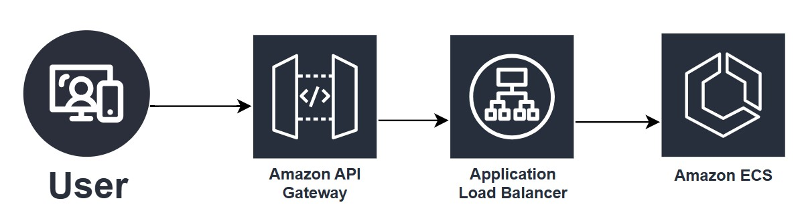
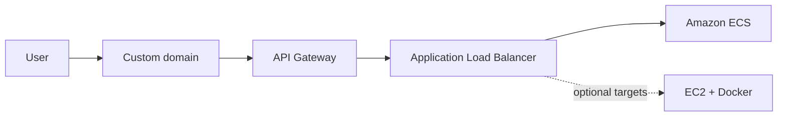

# 🌐 Domain → API Gateway → ALB → Docker (ECS & EC2)
Request path for a public API: a **custom domain** fronts **Amazon API Gateway**, which forwards to an **Application Load Balancer (ALB)**. The ALB sends traffic to **Dockerized** workloads on **Amazon ECS** and/or **Amazon EC2** instances registered as targets (hybrid or **ECS on EC2** capacity).

Reference diagram: [`diagram.jpg`](./diagram.jpg).

## 🔎 What the diagram shows
- **👤 User:** browser or mobile client calls your API hostname.
- **🚪 Amazon API Gateway:** edge API (REST, HTTP, or WebSocket) that terminates TLS, applies throttling/auth, and routes to the integration—here, toward the load balancer.
- **⚖️ Application Load Balancer:** distributes HTTP(S) across healthy targets in one or more target groups.
- **🐳 Amazon ECS:** containerized services (tasks/services) behind the ALB—the drawing highlights ECS as the downstream compute.

➡️ Linear flow in the image: **User → API Gateway → ALB → ECS**.

## 📋 Components
| Role | Service | Purpose |
| --- | --- | --- |
| **🌍 DNS / domain** | **Route 53** (typical) | **A/AAAA alias** (or CNAME) from your domain to the **API Gateway** custom domain endpoint. |
| **🚪 API edge** | **Amazon API Gateway** | Public API surface, versioning/stages, optional **AWS WAF**, integration to the **ALB** (HTTP proxy, private integration with **VPC link**, etc.—depends on design). |
| **⚖️ Load balancing** | **Application Load Balancer** | Layer-7 routing (host/path rules), health checks, TLS at the ALB or end-to-end toward targets. |
| **🐳 Containers** | **Amazon ECS** | **Docker** images as tasks/services; ALB target groups attach to ECS service discovery or task ENIs (**Fargate** or **EC2 launch type**). |
| **🖥️ Optional: EC2 targets** | **Amazon EC2** | Same ALB can register **EC2 instances** running **Docker** (standalone or as the capacity for **ECS on EC2**) when you need mixed or legacy targets. |

## 📡 Data flow
1. **🌍 Client → domain:** TLS to the API Gateway custom domain (ACM certificate on the API side).
2. **🚪 API Gateway → ALB:** Gateway invokes the ALB listener (regional); keep **timeouts**, **payload limits**, and **connection reuse** in mind when chaining HTTP hops.
3. **⚖️ ALB → Docker:** Listener rules forward to target groups backed by **ECS services** and, if applicable, **EC2 instance** targets running containers.

## 🛡️ Design notes (summary)

- **🔐 TLS:** use **ACM** for the custom domain on **API Gateway**; often a second cert on the **ALB** if TLS terminates there or for mTLS patterns.
- **🌐 Private ALB:** pair **API Gateway** with a **VPC link** so the ALB stays private; otherwise the ALB may be internet-facing—document which variant you use.
- **🎯 Target groups:** one ALB can fan out to multiple ECS services or EC2 target groups using **host-based** or **path-based** rules (similar ideas to other diagrams in this repo).
- **📊 Observability:** enable **CloudWatch** logs/metrics on API Gateway, ALB access logs, and **ECS** task metrics for end-to-end tracing.

## 🔀 Diagram vs. full platform

The exported drawing emphasizes **User → API Gateway → ALB → ECS**. This README also calls out **EC2 + Docker** as a common companion pattern (extra targets or **ECS on EC2**) so the folder matches the workflow you described.
