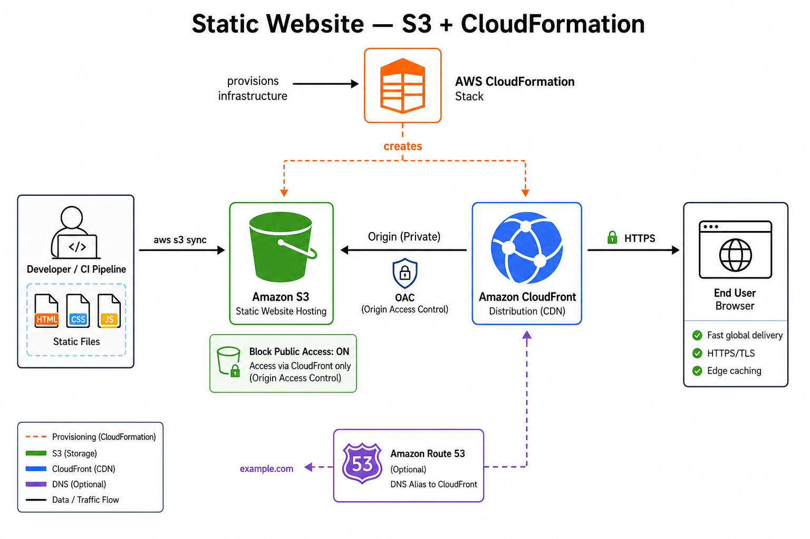
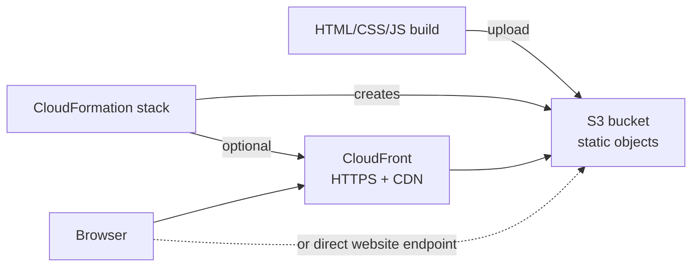

# 📄 Static website — S3 + CloudFormation
Deploy **static sites** built with **HTML, CSS, and JavaScript**: no servers, no containers. Assets live in **Amazon S3**; **AWS CloudFormation** provisions the bucket, access policies, and optionally **CloudFront** for HTTPS and CDN.

Reference diagram: [`diagram.jpg`](./diagram.jpg).



## 🔎 What the diagram shows
- **CloudFormation** provisions the **S3 bucket**, bucket policy, and (recommended) **CloudFront** distribution with **OAC**.
- **CI or developer** uploads static files (`index.html`, CSS, JS) to S3 (`aws s3 sync`).
- **Users** reach the site via **CloudFront** (HTTPS); origin is the private S3 bucket.
- Optional **Route 53** alias record points the custom domain to CloudFront.

> **Not covered here:** SPAs with client-side routing behind a custom API (still static assets, but you may need CloudFront error pages for deep links), or dynamic backends — use [`complete-infra-with-services-security/`](../complete-infra-with-services-security/) for containerized APIs.

## 🎯 When to use this model
| Fit | Example |
| --- | --- |
| Landing page, marketing site | `index.html`, assets, forms via third-party |
| Documentation / portfolio | Static HTML export |
| Simple admin-free hosting | Upload files to S3 (or CI sync); infra from one stack |
| Low cost, high durability | S3 + CloudFront; pay for storage and requests |

## 🧱 How it works


| Piece | Role |
| --- | --- |
| **S3 bucket** | Stores `index.html`, CSS, JS, images, `favicon.ico` |
| **Bucket policy** | Public read **or** CloudFront **OAC** only (recommended) |
| **CloudFormation** | Reproducible stack: bucket, policy, optional CloudFront + ACM cert |
| **CloudFront** (recommended) | HTTPS, caching, custom domain, hide direct S3 website URL |
| **Deploy artifact** | Folder of static files — `aws s3 sync`, CI pipeline, or `aws cloudformation deploy` + custom resource |

## ⚡ Quick pick
| If you need… | Setup |
| --- | --- |
| Fastest internal/demo site | S3 static website hosting + public read policy |
| Production with custom domain + HTTPS | S3 origin + **CloudFront** + ACM certificate |
| Repeatable envs (dev/staging/prod) | **CloudFormation** parameters per environment |
| SPA with client-side routes | CloudFront **custom error response** `403/404 → /index.html` |

## 📊 S3-only vs S3 + CloudFront
| Criterion | **S3 website endpoint** | **S3 + CloudFront** |
| --- | --- | --- |
| **HTTPS** | Limited (website endpoint quirks) | ✅ ACM on CloudFront |
| **Custom domain** | Awkward | ✅ Route 53 → CloudFront |
| **Caching / edge** | No | ✅ Global CDN |
| **Bucket exposure** | Often public read | **OAC** — bucket not public |
| **Cost at scale** | S3 requests only | + CloudFront; often better UX |
| **Production default** | Dev/demo only | ✅ **Recommended** |

## ✅ Choose this model when
- The app is **fully static** after build (no server-side rendering on AWS).
- Team is comfortable deploying **files**, not Docker images.
- You want **minimal ops** and **IaC** via CloudFormation.
- Traffic is read-heavy HTML/assets, not long-lived API connections.

## 🚫 Avoid when
| Situation | Better model |
| --- | --- |
| REST/GraphQL API, WebSockets | ECS + ALB — [`complete-infra-with-services-security/`](../complete-infra-with-services-security/) |
| Scheduled or event jobs | [`ecs-fargate-eventbridge/`](../ecs-fargate-eventbridge/) |
| Server-side auth sessions on your host | Container or Lambda backend |

## 🛠️ Deploy checklist
1. **Build** — produce static output (`dist/`, `build/`, or plain HTML folder).
2. **CloudFormation** — stack with S3 bucket, block public access aligned with OAC design, bucket policy, optional CloudFront distribution + OAC.
3. **Certificate** — ACM in **us-east-1** if using CloudFront with a custom domain.
4. **DNS** — Route 53 alias to CloudFront (or CNAME per your DNS provider).
5. **Upload** — `aws s3 sync ./build s3://bucket-name --delete` (CI or manual).
6. **Invalidate** — CloudFront cache invalidation on deploy when using CDN (`/*` or changed paths).

### Minimal stack shape (conceptual)
```yaml
# CloudFormation — illustrative; adjust names and OAC IDs in real templates
Resources:
  SiteBucket:
    Type: AWS::S3::Bucket
    Properties:
      PublicAccessBlockConfiguration:
        BlockPublicAcls: true
        BlockPublicPolicy: true
        IgnorePublicAcls: true
        RestrictPublicBuckets: true
  # SiteBucketPolicy + CloudFront::Distribution + OriginAccessControl
  # Parameters: DomainName, CertificateArn, Environment
```

Keep templates in your **deployment repo** or add a `cloudformation/` folder here when you have a canonical stack to version.

## 🔗 Related in this repo
- [`deploy-services/`](../deploy-services/) — all three deployment models.
- [`complete-infra-with-services-security/`](../complete-infra-with-services-security/) — dynamic apps + security layers.
- [`gateway/`](../gateway/) — if the static site calls an API behind API Gateway + ALB.

## 📚 AWS documentation
- [Hosting a static website on S3](https://docs.aws.amazon.com/AmazonS3/latest/userguide/WebsiteHosting.html)
- [CloudFront with S3 origin and OAC](https://docs.aws.amazon.com/AmazonCloudFront/latest/DeveloperGuide/private-content-restricting-access-to-s3.html)
- [CloudFormation S3 bucket](https://docs.aws.amazon.com/AWSCloudFormation/latest/UserGuide/aws-properties-s3-bucket.html)
- [Deploying CloudFormation stacks](https://docs.aws.amazon.com/AWSCloudFormation/latest/UserGuide/stacks.html)
